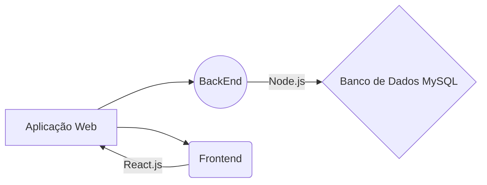

# 🚗 Projeto Lava Rápido

Bem-vindo ao repositório do projeto **Lava Rápido**, uma solução para o gerenciamento eficiente de um lava-rápido. O objetivo do sistema é simplificar as operações diárias, ajudando no controle de atendimentos, agendamentos, funcionários e clientes.

---

## 📂 Estrutura do Projeto

```
lava-rapido/
├── backend/           → Servidor Node.js + Express + MySQL
├── public/            → Arquivos estáticos
├── src/               → Frontend React
├── package.json       → Configuração do Vite + dependências
└── README.md          → Este tutorial
```

---

## 🚀 Instalação do Projeto

### 1⃣ Clone o repositório

```bash
git clone https://github.com/Renn4nn/lava-rapido
cd lava-rapido
```

---

### 2⃣ Instale as dependências

#### 👉 Na raiz (React frontend):

```bash
npm install
```

#### 👉 Depois vá para a pasta backend:

```bash
cd backend
npm install
```

---

## ⚙️ Configuração do Backend

### 3⃣ Crie o arquivo `.env`

Dentro da pasta `backend/`, crie um arquivo chamado `.env` com o seguinte conteúdo:

```env
# Dados do banco de dados
DB_PORT=3306
DB_HOST=localhost
DB_USER=root
DB_PASS=1234

# Dados do servidor backend
PORT=8800
IP=localhost
```

### 4⃣ Certifique-se de que o backend usa essas variáveis

No arquivo `backend/index.js`, adicione:

```js
require('dotenv').config();

app.listen(process.env.PORT, process.env.IP, () => {
    console.log(`Rodando servidor na porta ${process.env.PORT}`);
});
```

---

## 🔄 Execução do Projeto

### 5⃣ Crie a base de dados MySQL

Execute no seu MySQL:

```sql
CREATE DATABASE lava_rapido_users;
USE lava_rapido_users;

-- Criação da tabela de usuários
CREATE TABLE users (
    id INT AUTO_INCREMENT PRIMARY KEY,
    name VARCHAR(100) NOT NULL,
    email VARCHAR(100) NOT NULL UNIQUE,
    password VARCHAR(255) NOT NULL
);

-- Criação da tabela de serviços
CREATE TABLE servicos (
    id INT AUTO_INCREMENT PRIMARY KEY,
    tipo_servico VARCHAR(100) NOT NULL,
    placa VARCHAR(20) NOT NULL,
    modelo VARCHAR(100) NOT NULL,
    preco DECIMAL(10,2) NOT NULL,
    cliente VARCHAR(100) NOT NULL,
    funcionario VARCHAR(100) NOT NULL,
    data_hora DATETIME NOT NULL
);
```

---

### 6⃣ Inicie o servidor backend

Dentro da pasta `backend`:

```bash
npm start
```

---

### 7⃣ Inicie o frontend (React)

Volte para a raiz do projeto:

```bash
cd ..
npm run dev
```

---

## 🌐 Acessando o sistema

- Acesse o frontend via navegador:
  ```
  http://localhost:5173
  ```

---

## 📦 Base de Dados (MySQL)

Resumo das tabelas utilizadas:

- **users**: cadastro de usuários com `id`, `name`, `email`, `password`
- **servicos**: registro dos serviços com `tipo_servico`, `placa`, `modelo`, `preco`, `cliente`, `funcionario`, `data_hora`

---

## 🛠️ Tecnologias Utilizadas

- [React](https://reactjs.org/)
- [Vite](https://vitejs.dev/)
- [TailwindCSS](https://tailwindcss.com/)
- [Node.js](https://nodejs.org/)
- [Express](https://expressjs.com/)
- [MySQL](https://www.mysql.com/)

---

## 📌 Observações

- As senhas **não são criptografadas** (apenas para fins de teste).
- O projeto ainda está em desenvolvimento.

---

## 📁 Detalhamento dos Diretórios

### Backend

Neste diretório estão armazenados os arquivos referentes ao **backend**, desenvolvido com **Node.js** e utilizando **MySQL** como banco de dados. A aplicação backend gerencia a lógica de negócios e a comunicação com o banco de dados.

### Frontend

O diretório **frontend** contém os arquivos do **client-side**, desenvolvido em **React** com a linguagem de programação **JavaScript**. A aplicação oferece uma interface de fácil uso para os colaboradores do lava-rápido, permitindo a interação com o sistema de maneira intuitiva.

### Diagrama UML



---

## 👨‍💻 Autor

Desenvolvido por **[Renan](https://github.com/Renn4nn)**, **[Thafnis](https://github.com/Thafniss)**, **[Wilson](https://github.com/WilsonnJr)** 🚀
