# 🚗 Projeto Lava Rápido

Bem-vindo ao repositório do projeto **Lava Rápido**, uma solução para o gerenciamento eficiente de um lava-rápido. O objetivo do sistema é simplificar as operações diárias, ajudando no controle de atendimentos, agendamentos, funcionários e clientes.

---

## 📂 Estrutura do Projeto

```
lava-rapido/
├── backend/           → Servidor Node.js + Express + MySQL
├── public/            → Arquivos estáticos
├── src/               → Frontend React
├── package.json       → Configuração do Vite + dependências
└── README.md          → Este tutorial
```

---

## 🚀 Instalação do Projeto

### 1⃣ Clone o repositório

```bash
git clone https://github.com/Renn4nn/lava-rapido
cd lava-rapido
```

---

### 2⃣ Instale as dependências

#### 👉 Na raiz (React frontend):

```bash
npm install
```

#### 👉 Depois vá para a pasta backend:

```bash
cd backend
npm install
```

---

## ⚙️ Configuração do Backend

### 3⃣ Altere o IP no `index.js` para seu IP da rede local:

No arquivo `backend/index.js`, substitua o `app.listen()` por:

```js
app.listen(PORT, '192.168.0.130', () => {
    console.log(`Rodando servidor na porta ${PORT}`);
});
```

> ✅ Dica: use `ipconfig` no terminal (Windows) para descobrir seu IP local.

---

## 🔄 Execução do Projeto

### 4⃣ Inicie o servidor backend

Ainda dentro da pasta `backend`, rode:

```bash
npm start
```

> ⚠️ Obs: é necessário que você já tenha o **MySQL** instalado com a base de dados pronta.

---

### 5⃣ Inicie o frontend (React)

Volte para a raiz do projeto:

```bash
cd ..
npm run dev
```

---

## 🌐 Acessando o sistema

- Acesse o frontend via navegador:
  ```
  http://localhost:5173
  ```

- Ou de outro dispositivo na **mesma rede local**:
  ```
  http://<seu_ip_local>:5173
  ```

---

## 🛠️ Tecnologias Utilizadas

- [React](https://reactjs.org/)
- [Vite](https://vitejs.dev/)
- [TailwindCSS](https://tailwindcss.com/)
- [Node.js](https://nodejs.org/)
- [Express](https://expressjs.com/)
- [MySQL](https://www.mysql.com/)

---

## 📌 Observações

- As senhas **não são criptografadas** (apenas para fins de teste).
- O projeto ainda está em desenvolvimento.

---

## 📁 Detalhamento dos Diretórios

### Backend

Neste diretório estão armazenados os arquivos referentes ao **backend**, desenvolvido com **Node.js** e utilizando **MySQL** como banco de dados. A aplicação backend gerencia a lógica de negócios e a comunicação com o banco de dados.

### Frontend

O diretório **frontend** contém os arquivos do **client-side**, desenvolvido em **React** com a linguagem de programação **JavaScript**. A aplicação oferece uma interface de fácil uso para os colaboradores do lava-rápido, permitindo a interação com o sistema de maneira intuitiva.

### Diagrama UML

Abaixo, o diagrama UML descreve a arquitetura do projeto:

```mermaid
graph LR
A[Aplicação Web] --> B((BackEnd))
A --> C(Frontend)
B -- Node.js --> D{Banco de Dados mySQL}
C -- React.js --> A
```



---

## 👨‍💻 Autor

Desenvolvido por **[Renan](https://github.com/Renn4nn)**, **[Thafnis](https://github.com/Thafniss)**, **[Wilson](https://github.com/WilsonnJr)** 🚀

